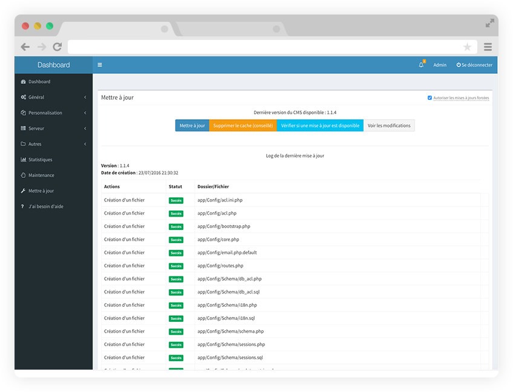

<!--
N.B.: This README was automatically generated by https://github.com/YunoHost/apps/tree/master/tools/README-generator
It shall NOT be edited by hand.
-->

# MineWeb for YunoHost

[](https://dash.yunohost.org/appci/app/mineweb)  

[](https://install-app.yunohost.org/?app=mineweb)

*[Lire ce readme en français.](./README_fr.md)*

> *This package allows you to install MineWeb quickly and simply on a YunoHost server.
If you don't have YunoHost, please consult [the guide](https://yunohost.org/#/install) to learn how to install it.*

## Overview

MineWeb est un CMS (c'est-à-dire un système de gestion de contenu), en plus simple, un site complètement personnalisable et intuitif, qui s'adaptera parfaitement à vos serveurs Minecraft !

Vous pourrez tenir vos joueurs au courant des actualités, leur faire acheter des articles sur la boutique... Vous pourrez personnaliser le CMS avec toutes sortes de thèmes ou plugins ! Ceux-ci sont disponibles sur le market ou peuvent être développés par vous-même.


**Shipped version:** 1.15.1~ynh2

## Screenshots



## Documentation and resources

* Official app website: <https://mineweb.org/>
* Official admin documentation: <https://docs.mineweb.org/>
* Upstream app code repository: <https://github.com/MineWeb/MineWebCMS/>
* YunoHost documentation for this app: <https://yunohost.org/app_mineweb>
* Report a bug: <https://github.com/YunoHost-Apps/mineweb_ynh/issues>

## Developer info

Please send your pull request to the [testing branch](https://github.com/YunoHost-Apps/mineweb_ynh/tree/testing).

To try the testing branch, please proceed like that.

``` bash
sudo yunohost app install https://github.com/YunoHost-Apps/mineweb_ynh/tree/testing --debug
or
sudo yunohost app upgrade mineweb -u https://github.com/YunoHost-Apps/mineweb_ynh/tree/testing --debug
```

**More info regarding app packaging:** <https://yunohost.org/packaging_apps>
