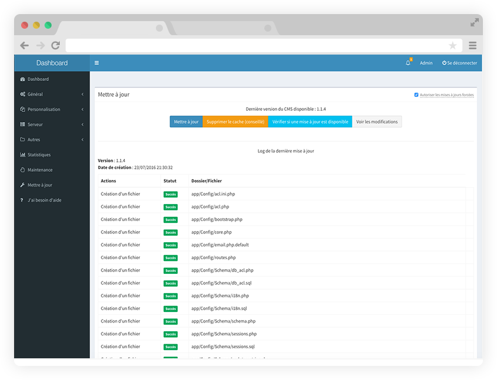

<!--
注意：此 README 由 <https://github.com/YunoHost/apps/tree/master/tools/readme_generator> 自动生成
请勿手动编辑。
-->

# YunoHost 上的 MineWeb

[](https://dash.yunohost.org/appci/app/mineweb)  

[](https://install-app.yunohost.org/?app=mineweb)

*[阅读此 README 的其它语言版本。](./ALL_README.md)*

> *通过此软件包，您可以在 YunoHost 服务器上快速、简单地安装 MineWeb。*  
> *如果您还没有 YunoHost，请参阅[指南](https://yunohost.org/install)了解如何安装它。*

## 概况

MineWeb is a CMS (i.e. a content management system), in simpler terms, a completely customizable and intuitive site, which will adapt perfectly to your Minecraft servers!

You can keep your players up to date with news, have them buy items from the store... You can customize the CMS with all kinds of themes or plugins! These are available on the market or can be developed by yourself.

**分发版本：** 1.15.2~ynh2

## 截图



## :red_circle: 负面特征

- **Upstream not maintained**: This software is not maintained anymore. Expect it to break down over time, be exposed to unfixed security breaches, etc.

## 文档与资源

- 官方应用网站： <https://mineweb.org/>
- 官方管理文档： <https://docs.mineweb.org/>
- 上游应用代码库： <https://github.com/MineWeb/MineWebCMS/>
- YunoHost 商店： <https://apps.yunohost.org/app/mineweb>
- 报告 bug： <https://github.com/YunoHost-Apps/mineweb_ynh/issues>

## 开发者信息

请向 [`testing` 分支](https://github.com/YunoHost-Apps/mineweb_ynh/tree/testing) 发送拉取请求。

如要尝试 `testing` 分支，请这样操作：

```bash
sudo yunohost app install https://github.com/YunoHost-Apps/mineweb_ynh/tree/testing --debug
或
sudo yunohost app upgrade mineweb -u https://github.com/YunoHost-Apps/mineweb_ynh/tree/testing --debug
```

**有关应用打包的更多信息：** <https://yunohost.org/packaging_apps>
